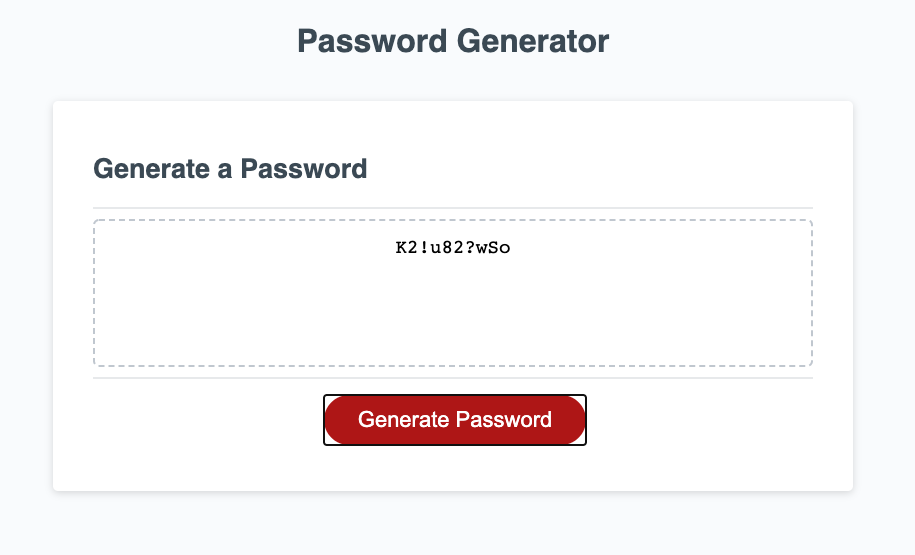

# Password-Generator-HW3

Last updated 10/27/20

INTRUDUCTION

This is a random password generator project, it is designed to ask the user four questions to create a password from a minimum of 8 characters to a maximum of 128 characters.

USER INTERFACE

The user is presented with a webpage thatcontaings a textbox and a button, the button when pressed starts the process of asking the user the type of characters they would like to include in the password.

USER STEPS

The user is presented with five pop up boxes that ask the following:

1.  How many characters? Min 8, Max 128?
    User is expected to type a number between 8 and 128.

2.  Include Upper case Letters?
    User is expected to click on the OK button to include Upper case letters, or click the cancel button to exclude upper case letters.

3.  Include Lower case Letters?
    User is expected to click on the OK button to include Lower case letters, or click the cancel button to exclude lower case letters.

4.  Include Numbers?
    User is expected to click on the OK button to include numbers click the cancel button to exclude numbers.  

5.  Include Special Characters?
    User is expected to click on the OK button to include special characters or click the cancel button to exclude special characters.

If the user fails to select any characters for the password, the program goes back to question #1.

Based on how the user responds to the above questions the program randomly selects specified characters in the specified character lenght.

PROGRAM LOGIC:

The program captures the response in question 1 and checks to make sure the password legth is between 8 and 128 characters, if the input is not within those limits the program returns to the initial question.
The other questions are stored as a true state, and are combined with an if statement that produces a corresponing array of all potetial characters for upper case letters, lower case letters, numbers and special characters.

Based on the user selection of character, the indiviual arrays are conbined into one master array, then a for loop is use to randomly pick characters from the master array, the loop ends when the number of cycles equals the inputed password legth.

Finaly the randomly generated password is display on the password box.

* Deployed application:
https://samrod777.github.io/Password-Generator-HW3/

* GitHub repository URL:
https://github.com/samrod777/Password-Generator-HW3

- - -
© 2020 Sam Rodriguez. All Rights Reserved.
